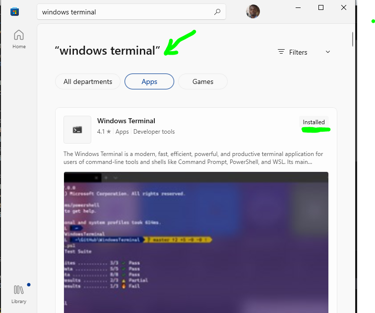
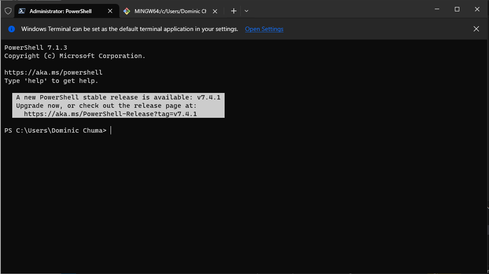
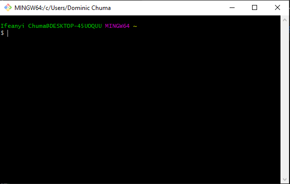

# DevOps_Project1
  
This is a collection of DevOps projects of mine, over time.

Here in this document, I'd also explain how I created the base folder, and all the initial installations that ad to be made, as weel as the tools that were initially needed to get started.

First, I installed "Windows Terminal" by going to the Microsoft Store and looking for the windows terminal and got it installed.  
Below screenshot shows the app on microsoft store.

Then search for the app among your installed apps and open the Windows Terminal. The opened app looks like this.....

Secondly, install git. Visit the official Git website to download the latest version of the Git installer for Windows, and launch.  
You should see this on your screen.

  

Thirdly, an free tier account on AWS should be created.

Fourthly, Install VS Code. Visit the official VS Code website to download the latest version of the VS Code installer for Windows.
